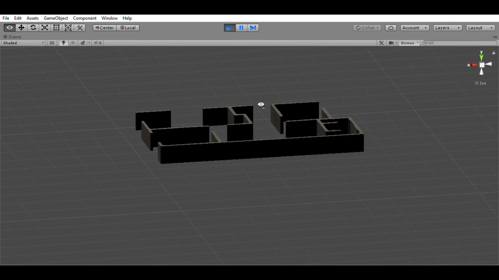
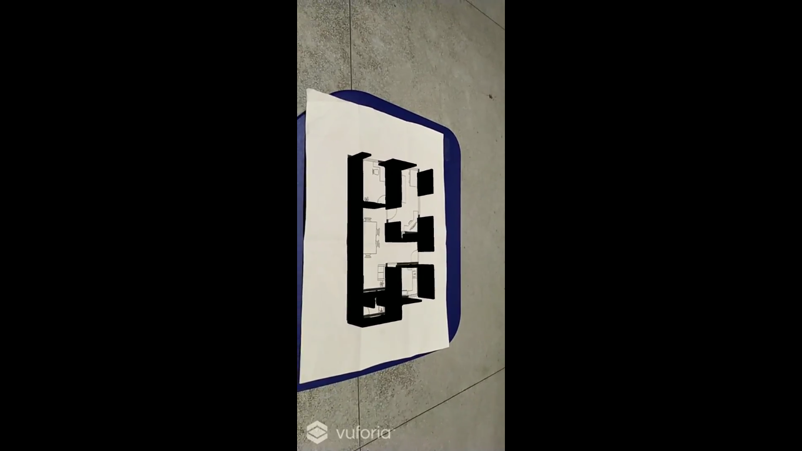

# Augmented reality to create model visualization of constructions drawings.
*Augmented reality app created using unity and vuforia. The app can create models to visualize in augmented reality based in 
a construction drawing.

**Extrusion model img example:**

**App runing example:**

